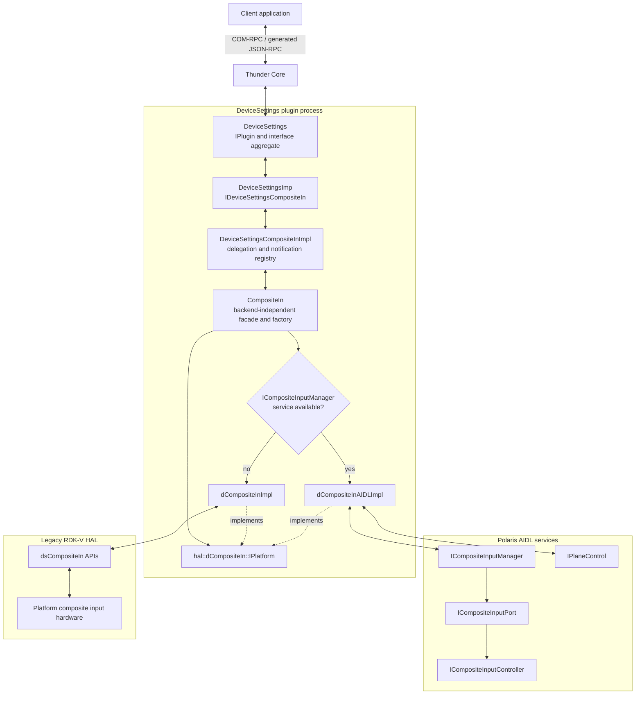
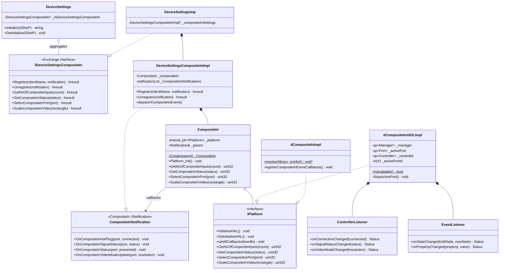
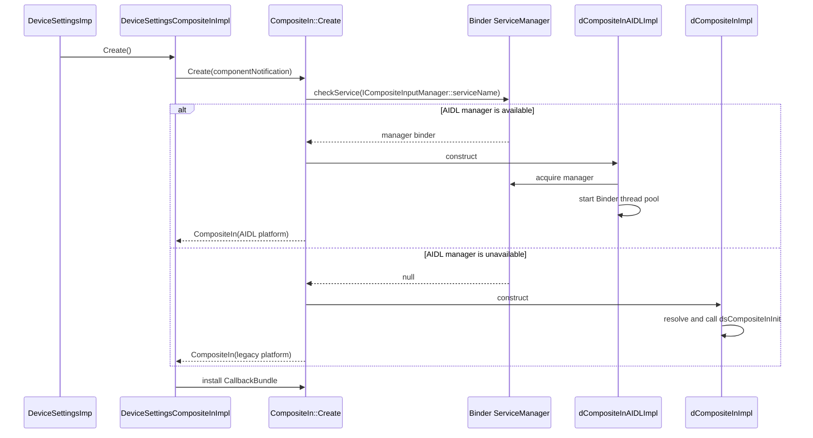
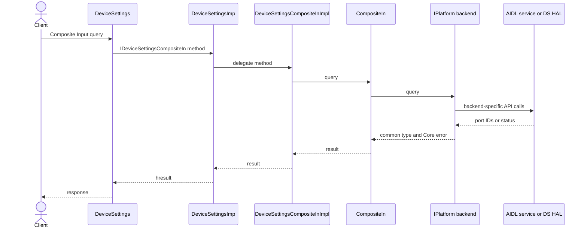
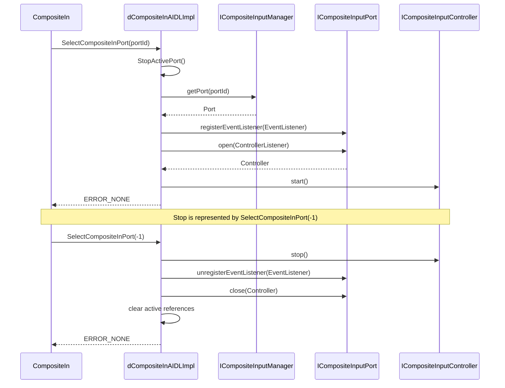
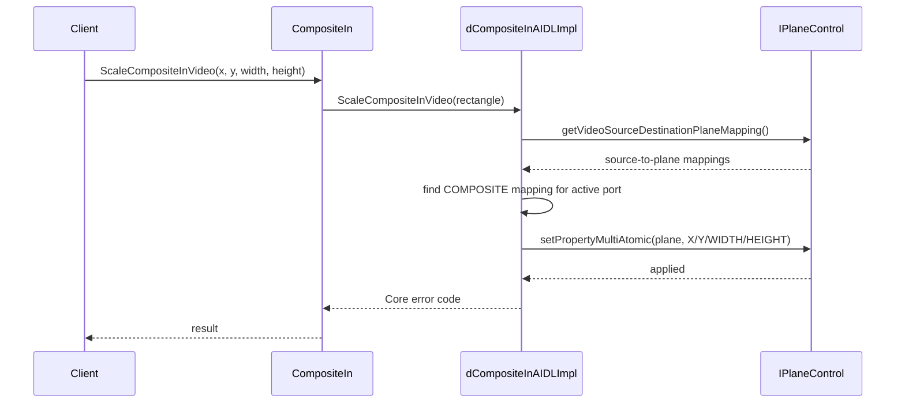
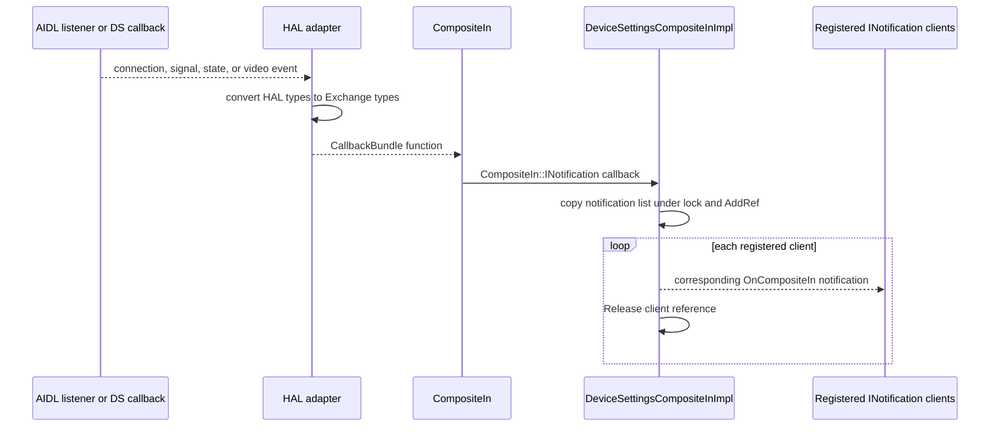

# Composite Input Architecture

## Purpose

Composite Input is a DeviceSettings component that exposes composite video input discovery, selection, status, scaling, and notifications through `Exchange::IDeviceSettingsCompositeIn`. It is aggregated by the DeviceSettings Thunder plugin rather than deployed as an independent plugin.

The component supports two hardware backends:

- **AIDL HAL:** Uses the Polaris CompositeInput and PlaneControl Binder services.
- **Legacy DS HAL:** Uses dynamically resolved `dsCompositeIn*` APIs from `RDK_DSHAL_NAME`.

The backend is selected at runtime. If `ICompositeInputManager` is published, `CompositeIn::Create()` constructs `dCompositeInAIDLImpl`; otherwise it constructs `dCompositeInImpl`.

## System Architecture

## Component Responsibilities

| Component | Responsibility |
| --- | --- |
| `DeviceSettings` | Manages Thunder lifecycle, aggregates `IDeviceSettingsCompositeIn`, and registers its notification sink. |
| `DeviceSettingsImp` | Implements the public Exchange interface and delegates Composite Input operations to the component implementation. |
| `DeviceSettingsCompositeInImpl` | Owns the `CompositeIn` facade, manages client notification registrations, and dispatches HAL events. |
| `CompositeIn` | Provides a backend-independent API, installs callback functions, and selects the AIDL or legacy backend. |
| `hal::dCompositeIn::IPlatform` | Defines the common lifecycle, query, selection, and scaling contract. |
| `dCompositeInAIDLImpl` | Maps the common contract to CompositeInput and PlaneControl AIDL services. |
| `dCompositeInImpl` | Maps the common contract to legacy `dsCompositeIn*` functions loaded from the DS HAL library. |

## Public Operations

| Exchange operation | Facade operation | AIDL mapping | Legacy mapping |
| --- | --- | --- | --- |
| Get input count | `GetNrOfCompositeInputs` | `ICompositeInputManager::getPortIds` | `dsCompositeInGetNumberOfInputs` |
| Get active status | `GetCompositeInStatus` | `getPortIds`, `getPort`, `ICompositeInputPort::getStatus` | `dsCompositeInGetStatus` |
| Start/select input | `SelectCompositeInPort(port)` | `getPort`, `registerEventListener`, `open`, `start` | `dsCompositeInSelectPort(port)` |
| Stop input | `SelectCompositeInPort(-1)` | `stop`, `unregisterEventListener`, `close` | `dsCompositeInSelectPort(-1)` |
| Set video rectangle | `ScaleCompositeInVideo` | `IPlaneControl::setPropertyMultiAtomic` with `X`, `Y`, `WIDTH`, and `HEIGHT` | `dsCompositeInScaleVideo` |

## Event Mapping

| Exchange notification | AIDL source | Legacy source |
| --- | --- | --- |
| `OnCompositeInHotPlug` | `ICompositeInputControllerListener::onConnectionChanged` | `dsCompositeInRegisterConnectCB` |
| `OnCompositeInSignalStatus` | `onSignalStatusChanged` | `dsCompositeInRegisterSignalChangeCB` |
| `OnCompositeInStatus` | `ICompositeInputEventListener::onStateChanged` | `dsCompositeInRegisterStatusChangeCB` |
| `OnCompositeInVideoModeUpdate` | `onVideoModeChanged` | `dsCompositeInRegisterVideoModeUpdateCB` |

## Class Diagram

## Initialization And Backend Selection

## Query Call Flow

The following flow applies to input-count and status queries. The facade does not expose backend-specific types to upper layers.

## AIDL Start And Stop Flow

Only one Composite Input port is active in the adapter at a time. Selecting another port first releases the current controller.

## Video Rectangle Flow

## Asynchronous Event Flow

## Threading And Ownership

- `DeviceSettingsCompositeInImpl` protects notification registration with `_callbackLock` and holds an Exchange reference for each registered client.
- Event dispatch copies and `AddRef`s the client list before invoking callbacks, avoiding callbacks while the registration lock is held.
- `dCompositeInAIDLImpl` protects active Binder objects and selection operations with `_adminLock`.
- AIDL Binder callbacks run on the Binder thread pool started during adapter initialization.
- The AIDL adapter retains only the active `ICompositeInputPort`, controller, and listeners. Stop and destruction release them in reverse order.
- The legacy adapter serializes DS HAL operations with `dsCompositeInLock` and stores callback functions in its callback bundle bridge.

## Failure And Fallback Behavior

- AIDL selection occurs only when `ICompositeInputManager` is available during factory execution.
- If it is unavailable, construction falls back to the legacy DS HAL implementation.
- AIDL method failures are translated to `Core::ERROR_UNAVAILABLE`, `Core::ERROR_BAD_REQUEST`, or `Core::ERROR_GENERAL` as appropriate.
- Plane scaling requires both an active Composite Input port and a COMPOSITE source-to-plane mapping.
- Runtime loss of an AIDL service is reported by subsequent method failures; backend selection is not changed for an already constructed facade.

## Build Integration

AIDL support is compiled only when CMake finds all required generated interfaces and libraries:

- CompositeInput 0.2 headers and library
- PlaneControl 0.2 headers and library
- Common AIDL property types
- Android Binder headers, `libbinder`, and `libutils`

When found, the implementation target defines `ENABLE_COMPOSITEINPUT_AIDL`, adds `dCompositeInAIDLImpl.cpp`, and uses C++17 for generated `std::optional` and `std::variant` types. If any artifact is absent, the target remains legacy-only.