# HdmiIn AIDL HAL Architecture Document

## Table of Contents
1. [Overview](#overview)
2. [System Architecture](#system-architecture)
3. [Class Hierarchy](#class-hierarchy)
4. [Component Descriptions](#component-descriptions)
5. [Detailed Call Flows](#detailed-call-flows)
6. [Sequence Diagrams](#sequence-diagrams)
7. [Data Flow](#data-flow)
8. [Integration Points](#integration-points)

---

## Overview

The HdmiIn AIDL HAL architecture provides a factory pattern-based solution for supporting both legacy RDKV HAL and modern AIDL HAL implementations for HDMI Input device control. The design ensures transparent selection and seamless operation regardless of the underlying HAL backend.

### Key Design Principles

- **Factory Pattern**: Automatic HAL implementation detection and selection
- **Interface Abstraction**: Common `IPlatform` interface for all implementations
- **Backward Compatibility**: Existing code works unchanged
- **Extensibility**: Easy to add new HAL implementations
- **Separation of Concerns**: Each implementation isolated in its own module

---

## System Architecture

### High-Level Architecture Diagram

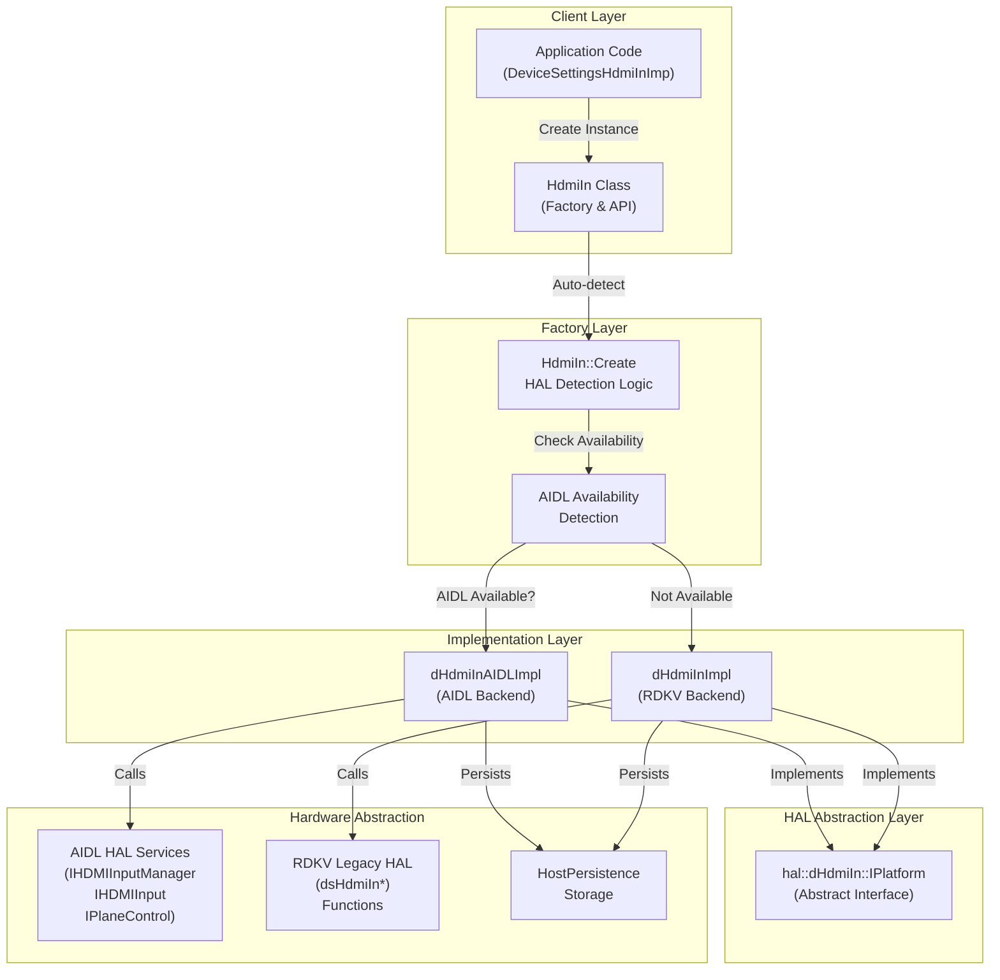
```mermaid
graph TB
    subgraph Client Layer
        APP["Application Code<br/>(DeviceSettingsHdmiInImp)"]
        HDMI["HdmiIn Class<br/>(Factory & API)"]
    end

    subgraph Factory Layer
        FACTORY["HdmiIn::Create<br/>HAL Detection Logic"]
        DETECT["AIDL Availability<br/>Detection"]
    end

    subgraph HAL Abstraction Layer
        IFACE["hal::dHdmiIn::IPlatform<br/>(Abstract Interface)"]
    end

    subgraph Implementation Layer
        AIDL["dHdmiInAIDLImpl<br/>(AIDL Backend)"]
        RDKV["dHdmiInImpl<br/>(RDKV Backend)"]
    end

    subgraph Hardware Abstraction
        AIDL_HAL["AIDL HAL Services<br/>(IHDMIInputManager<br/>IHDMIInput<br/>IPlaneControl)"]
        RDKV_HAL["RDKV Legacy HAL<br/>(dsHdmiIn*)<br/>Functions"]
        PERSIST["HostPersistence<br/>Storage"]
    end

    APP -->|Create Instance| HDMI
    HDMI -->|Auto-detect| FACTORY
    FACTORY -->|Check Availability| DETECT
    DETECT -->|AIDL Available?| AIDL
    DETECT -->|Not Available| RDKV
    AIDL -->|Implements| IFACE
    RDKV -->|Implements| IFACE
    AIDL -->|Calls| AIDL_HAL
    RDKV -->|Calls| RDKV_HAL
    AIDL -->|Persists| PERSIST
    RDKV -->|Persists| PERSIST
```

### Deployment Architecture

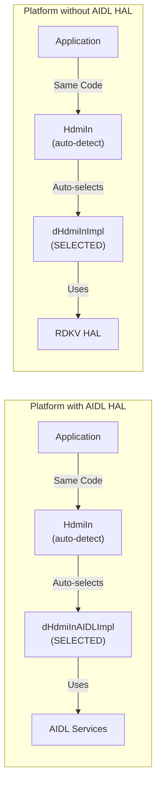
```mermaid
graph LR
    subgraph Platform_With_AIDL["Platform with AIDL HAL"]
        APP1["Application"]
        HDMI1["HdmiIn<br/>(auto-detect)"]
        IMPL1["dHdmiInAIDLImpl<br/>(SELECTED)"]
        HAL1["AIDL Services"]
    end

    subgraph Platform_Without_AIDL["Platform without AIDL HAL"]
        APP2["Application"]
        HDMI2["HdmiIn<br/>(auto-detect)"]
        IMPL2["dHdmiInImpl<br/>(SELECTED)"]
        HAL2["RDKV HAL"]
    end

    APP1 -->|Same Code| HDMI1
    HDMI1 -->|Auto-selects| IMPL1
    IMPL1 -->|Uses| HAL1

    APP2 -->|Same Code| HDMI2
    HDMI2 -->|Auto-selects| IMPL2
    IMPL2 -->|Uses| HAL2
```

---

## Class Hierarchy

### Interface Hierarchy Diagram

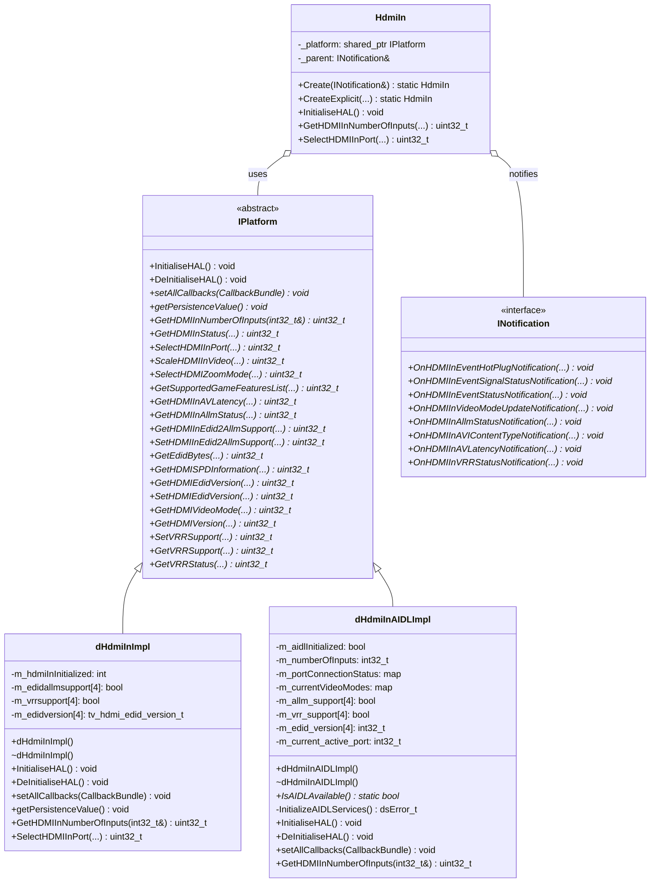
```mermaid
classDiagram
    class IPlatform {
        <<abstract>>
        +InitialiseHAL() void
        +DeInitialiseHAL() void
        +setAllCallbacks(CallbackBundle) void*
        +getPersistenceValue() void*
        +GetHDMIInNumberOfInputs(int32_t&) uint32_t*
        +GetHDMIInStatus(...) uint32_t*
        +SelectHDMIInPort(...) uint32_t*
        +ScaleHDMIInVideo(...) uint32_t*
        +SelectHDMIZoomMode(...) uint32_t*
        +GetSupportedGameFeaturesList(...) uint32_t*
        +GetHDMIInAVLatency(...) uint32_t*
        +GetHDMIInAllmStatus(...) uint32_t*
        +GetHDMIInEdid2AllmSupport(...) uint32_t*
        +SetHDMIInEdid2AllmSupport(...) uint32_t*
        +GetEdidBytes(...) uint32_t*
        +GetHDMISPDInformation(...) uint32_t*
        +GetHDMIEdidVersion(...) uint32_t*
        +SetHDMIEdidVersion(...) uint32_t*
        +GetHDMIVideoMode(...) uint32_t*
        +GetHDMIVersion(...) uint32_t*
        +SetVRRSupport(...) uint32_t*
        +GetVRRSupport(...) uint32_t*
        +GetVRRStatus(...) uint32_t*
    }

    class dHdmiInImpl {
        -m_hdmiInInitialized: int
        -m_edidallmsupport[4]: bool
        -m_vrrsupport[4]: bool
        -m_edidversion[4]: tv_hdmi_edid_version_t
        +dHdmiInImpl()
        ~dHdmiInImpl()
        +InitialiseHAL() void
        +DeInitialiseHAL() void
        +setAllCallbacks(CallbackBundle) void
        +getPersistenceValue() void
        +GetHDMIInNumberOfInputs(int32_t&) uint32_t
        +SelectHDMIInPort(...) uint32_t
    }

    class dHdmiInAIDLImpl {
        -m_aidlInitialized: bool
        -m_numberOfInputs: int32_t
        -m_portConnectionStatus: map
        -m_currentVideoModes: map
        -m_allm_support[4]: bool
        -m_vrr_support[4]: bool
        -m_edid_version[4]: int32_t
        -m_current_active_port: int32_t
        +dHdmiInAIDLImpl()
        ~dHdmiInAIDLImpl()
        +IsAIDLAvailable()* static bool
        -InitializeAIDLServices() dsError_t
        +InitialiseHAL() void
        +DeInitialiseHAL() void
        +setAllCallbacks(CallbackBundle) void
        +GetHDMIInNumberOfInputs(int32_t&) uint32_t
    }

    class HdmiIn {
        -_platform: shared_ptr IPlatform
        -_parent: INotification&
        +Create(INotification&) static HdmiIn
        +CreateExplicit(...) static HdmiIn
        +InitialiseHAL() void
        +GetHDMIInNumberOfInputs(...) uint32_t
        +SelectHDMIInPort(...) uint32_t
    }

    class INotification {
        <<interface>>
        +OnHDMIInEventHotPlugNotification(...)* void
        +OnHDMIInEventSignalStatusNotification(...)* void
        +OnHDMIInEventStatusNotification(...)* void
        +OnHDMIInVideoModeUpdateNotification(...)* void
        +OnHDMIInAllmStatusNotification(...)* void
        +OnHDMIInAVIContentTypeNotification(...)* void
        +OnHDMIInAVLatencyNotification(...)* void
        +OnHDMIInVRRStatusNotification(...)* void
    }

    IPlatform <|-- dHdmiInImpl
    IPlatform <|-- dHdmiInAIDLImpl
    HdmiIn o-- IPlatform : uses
    HdmiIn o-- INotification : notifies
```

---

## Component Descriptions

### 1. HdmiIn Class (Factory & Facade)

**Location**: `plugin/HdmiIn.h`

**Purpose**: Serves as the factory and facade for HdmiIn operations. Automatically detects and instantiates the appropriate HAL implementation.

**Key Responsibilities**:
- Automatic HAL implementation detection
- Instance creation and lifecycle management
- Event callback delegation to INotification
- API delegation to underlying platform implementation

**Member Variables**:
- `std::shared_ptr<IPlatform> _platform` - Reference to active implementation
- `INotification& _parent` - Notification handler for events

---

### 2. IPlatform Interface (Abstract)

**Location**: `plugin/hal/dHdmiIn.h`

**Purpose**: Defines the common interface that all HAL implementations must provide.

**Method Categories**:

| Category | Methods | Purpose |
|----------|---------|---------|
| Lifecycle | `InitialiseHAL()`, `DeInitialiseHAL()` | Setup/cleanup |
| Callbacks | `setAllCallbacks()`, `getPersistenceValue()` | Event registration |
| Input Control | `GetHDMIInNumberOfInputs()`, `SelectHDMIInPort()` | Port management |
| Video Control | `ScaleHDMIInVideo()`, `SelectHDMIZoomMode()` | Video settings |
| Capabilities | `GetSupportedGameFeaturesList()`, `GetHDMIVersion()` | Feature query |
| EDID/HDCP | `GetEdidBytes()`, `GetHDMIEdidVersion()` | EDID management |
| ALLM Support | `GetHDMIInAllmStatus()`, `SetHDMIInEdid2AllmSupport()` | Game mode |
| VRR Support | `GetVRRSupport()`, `SetVRRSupport()`, `GetVRRStatus()` | Adaptive refresh |

---

### 3. dHdmiInImpl (RDKV HAL Implementation)

**Location**: `plugin/hal/dHdmiInImpl.h`

**Purpose**: Adapter/wrapper for legacy RDKV HAL services using procedural C-style APIs.

**Key Characteristics**:
- Implements all 21 IPlatform methods
- Direct calls to RDKV HAL functions (dsHdmiIn*)
- Uses global callback functions for event handling
- Manages persistence via HostPersistence
- Production-tested, stable implementation

---

### 4. dHdmiInAIDLImpl (AIDL HAL Implementation - NEW)

**Location**: `plugin/hal/dHdmiInAIDLImpl.h`

**Purpose**: Adapter for modern AIDL HAL services using interface-based async communication.

**Key Characteristics**:
- Skeleton implementation with TODO markers for development
- Service discovery via `IsAIDLAvailable()`
- Per-port AIDL service orchestration
- State caching for async event handling

**Private State**:
- `bool m_aidlInitialized` - Initialization flag
- `int32_t m_numberOfInputs` - Discovered port count
- `std::map<int32_t, HDMIVideoPortResolution> m_currentVideoModes` - Mode cache
- `bool m_allm_support[4]` - ALLM capability per port
- `bool m_vrr_support[4]` - VRR capability per port
- `int32_t m_edid_version[4]` - EDID version per port
- `int32_t m_current_active_port` - Currently active port

---

## Detailed Call Flows

### Factory Detection & Selection Flow

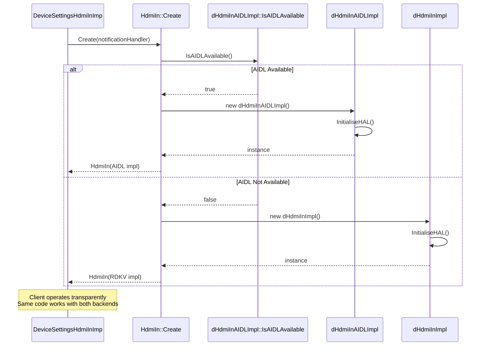
```mermaid
sequenceDiagram
    participant Client as DeviceSettingsHdmiInImp
    participant Factory as HdmiIn::Create
    participant Detector as dHdmiInAIDLImpl::IsAIDLAvailable
    participant AIDL as dHdmiInAIDLImpl
    participant RDKV as dHdmiInImpl

    Client->>Factory: Create(notificationHandler)
    
    Factory->>Detector: IsAIDLAvailable()
    
    alt AIDL Available
        Detector-->>Factory: true
        Factory->>AIDL: new dHdmiInAIDLImpl()
        AIDL->>AIDL: InitialiseHAL()
        AIDL-->>Factory: instance
        Factory-->>Client: HdmiIn(AIDL impl)
    else AIDL Not Available
        Detector-->>Factory: false
        Factory->>RDKV: new dHdmiInImpl()
        RDKV->>RDKV: InitialiseHAL()
        RDKV-->>Factory: instance
        Factory-->>Client: HdmiIn(RDKV impl)
    end
    
    Note over Client: Client operates transparently<br/>Same code works with both backends
```

### Port Selection Flow (RDKV Backend)

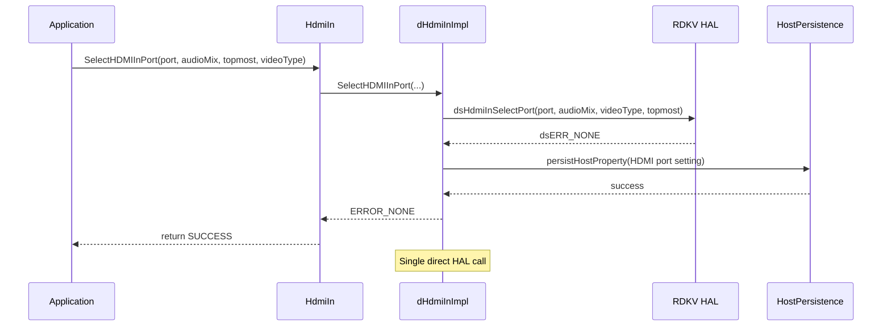
```mermaid
sequenceDiagram
    participant App as Application
    participant HdmiIn as HdmiIn
    participant RDKV as dHdmiInImpl
    participant HAL as RDKV HAL
    participant Persist as HostPersistence

    App->>HdmiIn: SelectHDMIInPort(port, audioMix, topmost, videoType)
    HdmiIn->>RDKV: SelectHDMIInPort(...)
    
    RDKV->>HAL: dsHdmiInSelectPort(port, audioMix, videoType, topmost)
    HAL-->>RDKV: dsERR_NONE
    
    RDKV->>Persist: persistHostProperty(HDMI port setting)
    Persist-->>RDKV: success
    
    RDKV-->>HdmiIn: ERROR_NONE
    HdmiIn-->>App: return SUCCESS
    
    Note over RDKV: Single direct HAL call
```

### Port Selection Flow (AIDL Backend - Planned)

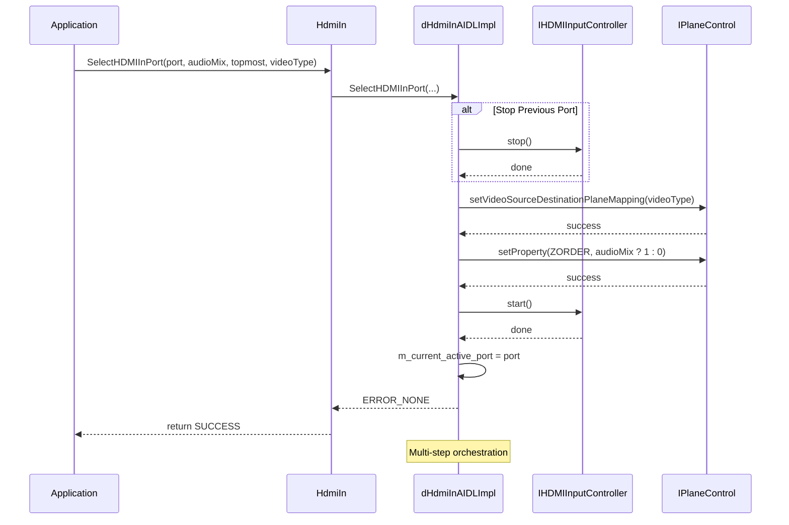
```mermaid
sequenceDiagram
    participant App as Application
    participant HdmiIn as HdmiIn
    participant AIDL as dHdmiInAIDLImpl
    participant Controller as IHDMIInputController
    participant Plane as IPlaneControl

    App->>HdmiIn: SelectHDMIInPort(port, audioMix, topmost, videoType)
    HdmiIn->>AIDL: SelectHDMIInPort(...)
    
    alt Stop Previous Port
        AIDL->>Controller: stop()
        Controller-->>AIDL: done
    end
    
    AIDL->>Plane: setVideoSourceDestinationPlaneMapping(videoType)
    Plane-->>AIDL: success
    
    AIDL->>Plane: setProperty(ZORDER, audioMix ? 1 : 0)
    Plane-->>AIDL: success
    
    AIDL->>Controller: start()
    Controller-->>AIDL: done
    
    AIDL->>AIDL: m_current_active_port = port
    AIDL-->>HdmiIn: ERROR_NONE
    HdmiIn-->>App: return SUCCESS
    
    Note over AIDL: Multi-step orchestration
```

---

## Sequence Diagrams

### Initialization Sequence

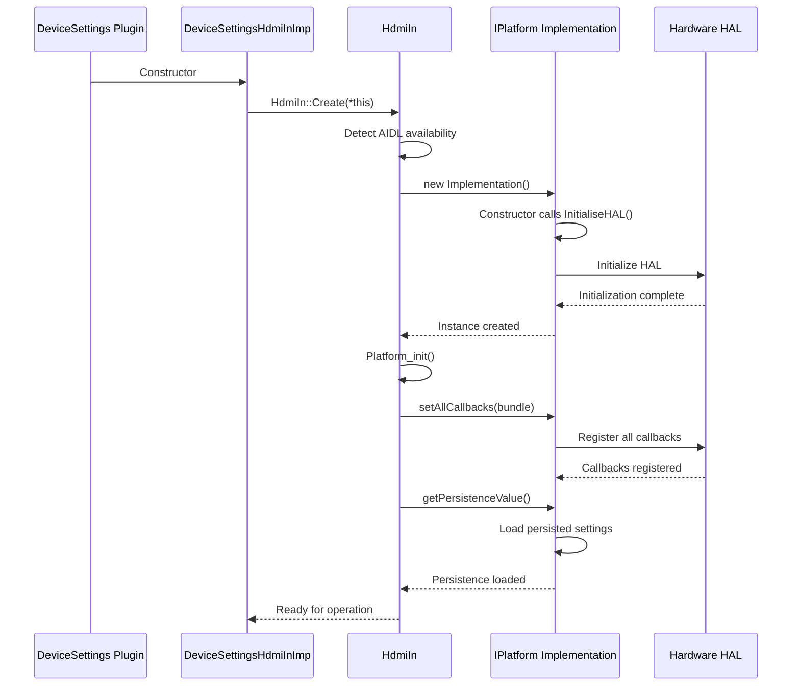
```mermaid
sequenceDiagram
    participant Plugin as DeviceSettings Plugin
    participant DSImpl as DeviceSettingsHdmiInImp
    participant HdmiIn as HdmiIn
    participant Impl as IPlatform Implementation
    participant HAL as Hardware HAL

    Plugin->>DSImpl: Constructor
    DSImpl->>HdmiIn: HdmiIn::Create(*this)
    
    HdmiIn->>HdmiIn: Detect AIDL availability
    HdmiIn->>Impl: new Implementation()
    
    Impl->>Impl: Constructor calls InitialiseHAL()
    Impl->>HAL: Initialize HAL
    HAL-->>Impl: Initialization complete
    
    Impl-->>HdmiIn: Instance created
    
    HdmiIn->>HdmiIn: Platform_init()
    HdmiIn->>Impl: setAllCallbacks(bundle)
    Impl->>HAL: Register all callbacks
    HAL-->>Impl: Callbacks registered
    
    HdmiIn->>Impl: getPersistenceValue()
    Impl->>Impl: Load persisted settings
    Impl-->>HdmiIn: Persistence loaded
    
    HdmiIn-->>DSImpl: Ready for operation
```

### Event Notification Sequence

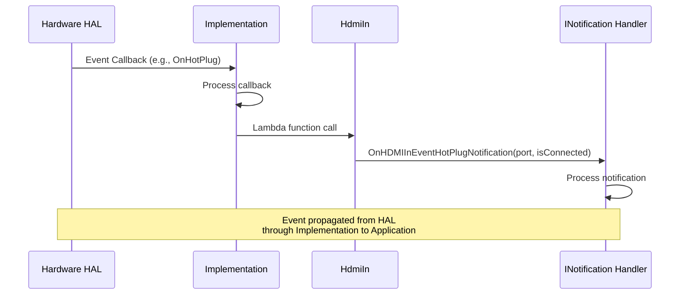
```mermaid
sequenceDiagram
    participant HAL as Hardware HAL
    participant Impl as Implementation
    participant HdmiIn as HdmiIn
    participant INotif as INotification Handler

    HAL->>Impl: Event Callback (e.g., OnHotPlug)
    
    Impl->>Impl: Process callback
    Impl->>HdmiIn: Lambda function call
    
    HdmiIn->>INotif: OnHDMIInEventHotPlugNotification(port, isConnected)
    
    INotif->>INotif: Process notification
    
    Note over HAL,INotif: Event propagated from HAL<br/>through Implementation to Application
```

### EDID Management Sequence

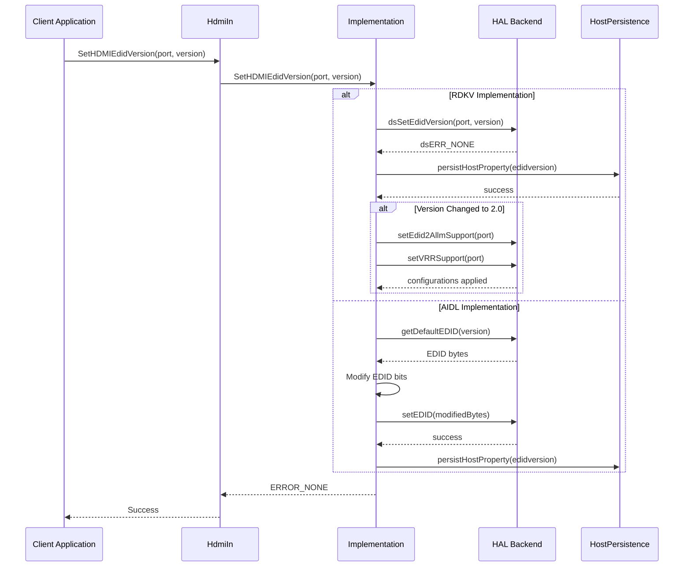
```mermaid
sequenceDiagram
    participant Client as Client Application
    participant HdmiIn as HdmiIn
    participant Impl as Implementation
    participant HAL as HAL Backend
    participant Persist as HostPersistence

    Client->>HdmiIn: SetHDMIEdidVersion(port, version)
    HdmiIn->>Impl: SetHDMIEdidVersion(port, version)
    
    alt RDKV Implementation
        Impl->>HAL: dsSetEdidVersion(port, version)
        HAL-->>Impl: dsERR_NONE
        
        Impl->>Persist: persistHostProperty(edidversion)
        Persist-->>Impl: success
        
        alt Version Changed to 2.0
            Impl->>HAL: setEdid2AllmSupport(port)
            Impl->>HAL: setVRRSupport(port)
            HAL-->>Impl: configurations applied
        end
    else AIDL Implementation
        Impl->>HAL: getDefaultEDID(version)
        HAL-->>Impl: EDID bytes
        
        Impl->>Impl: Modify EDID bits
        
        Impl->>HAL: setEDID(modifiedBytes)
        HAL-->>Impl: success
        
        Impl->>Persist: persistHostProperty(edidversion)
    end
    
    Impl-->>HdmiIn: ERROR_NONE
    HdmiIn-->>Client: Success
```

---

## Data Flow

### Port Selection Data Flow

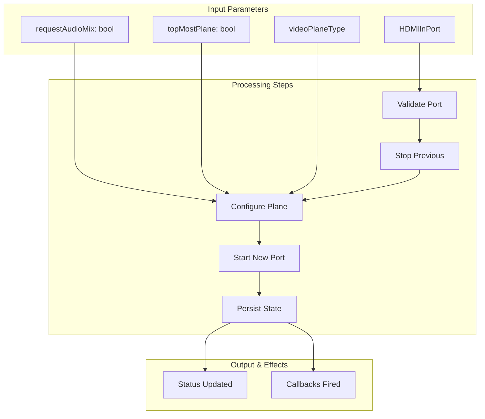
```mermaid
graph TB
    subgraph Input["Input Parameters"]
        PORT["HDMIInPort"]
        AUDIO["requestAudioMix: bool"]
        TOPMOST["topMostPlane: bool"]
        PLANE["videoPlaneType"]
    end

    subgraph Processing["Processing Steps"]
        VALIDATE["Validate Port"]
        STOP_PREV["Stop Previous"]
        CONFIG["Configure Plane"]
        START["Start New Port"]
        PERSIST["Persist State"]
    end

    subgraph Output["Output & Effects"]
        STATUS["Status Updated"]
        CALLBACKS["Callbacks Fired"]
    end

    PORT --> VALIDATE
    AUDIO --> CONFIG
    TOPMOST --> CONFIG
    PLANE --> CONFIG
    
    VALIDATE --> STOP_PREV
    STOP_PREV --> CONFIG
    CONFIG --> START
    START --> PERSIST
    
    PERSIST --> STATUS
    PERSIST --> CALLBACKS
```

### Video Mode Resolution Data Flow

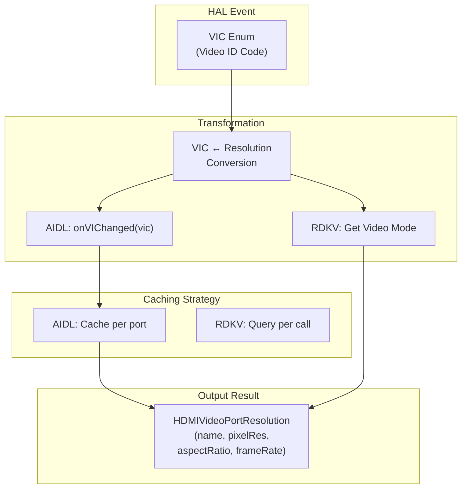
```mermaid
graph TB
    subgraph Source["HAL Event"]
        VIC["VIC Enum<br/>(Video ID Code)"]
    end

    subgraph Transform["Transformation"]
        CONVERSION["VIC ↔ Resolution<br/>Conversion"]
        AIDL_CONVERT["AIDL: onVIChanged(vic)"]
        RDKV_QUERY["RDKV: Get Video Mode"]
    end

    subgraph Cache["Caching Strategy"]
        AIDL_CACHE["AIDL: Cache per port"]
        RDKV_NOCACHE["RDKV: Query per call"]
    end

    subgraph Output["Output Result"]
        RESOLUTION["HDMIVideoPortResolution<br/>(name, pixelRes,<br/>aspectRatio, frameRate)"]
    end

    VIC --> CONVERSION
    CONVERSION --> AIDL_CONVERT
    CONVERSION --> RDKV_QUERY
    
    AIDL_CONVERT --> AIDL_CACHE
    AIDL_CACHE --> RESOLUTION
    
    RDKV_QUERY --> RESOLUTION
```

---

## Integration Points

### 1. Plugin Lifecycle Integration

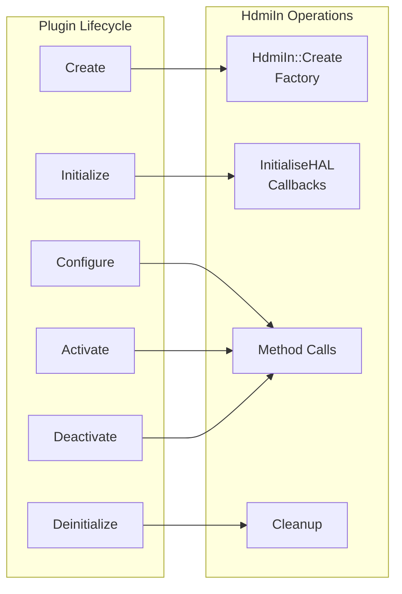
```mermaid
graph LR
    subgraph Lifecycle["Plugin Lifecycle"]
        CREATE["Create"]
        INIT["Initialize"]
        CONFIGURE["Configure"]
        ACTIVATE["Activate"]
        DEACTIVATE["Deactivate"]
        DEINIT["Deinitialize"]
    end

    subgraph HdmiIn_Ops["HdmiIn Operations"]
        HDMI_CREATE["HdmiIn::Create<br/>Factory"]
        HDMI_INIT["InitialiseHAL<br/>Callbacks"]
        HDMI_USE["Method Calls"]
        HDMI_CLEANUP["Cleanup"]
    end

    CREATE --> HDMI_CREATE
    INIT --> HDMI_INIT
    CONFIGURE --> HDMI_USE
    ACTIVATE --> HDMI_USE
    DEACTIVATE --> HDMI_USE
    DEINIT --> HDMI_CLEANUP
```

### 2. Callback Architecture Integration

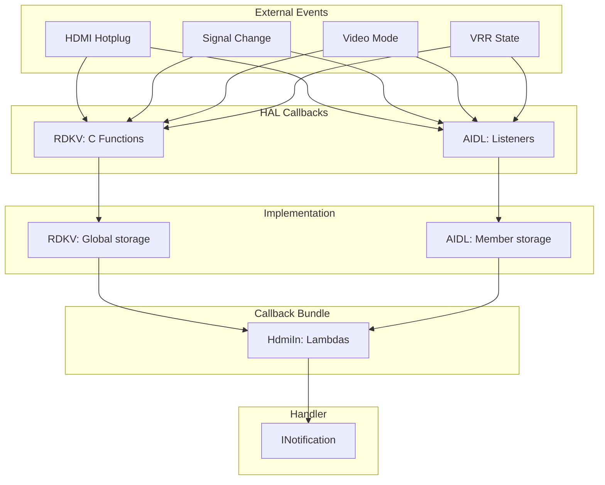
```mermaid
graph TB
    subgraph External["External Events"]
        HOTPLUG["HDMI Hotplug"]
        SIGNAL["Signal Change"]
        VIDEO["Video Mode"]
        VRR["VRR State"]
    end

    subgraph HAL_Callbacks["HAL Callbacks"]
        RDKV_CB["RDKV: C Functions"]
        AIDL_CB["AIDL: Listeners"]
    end

    subgraph Impl_Layer["Implementation"]
        RDKV_STORE["RDKV: Global storage"]
        AIDL_STORE["AIDL: Member storage"]
    end

    subgraph Bundle["Callback Bundle"]
        LAMBDA["HdmiIn: Lambdas"]
    end

    subgraph Notification["Handler"]
        IFACE["INotification"]
    end

    HOTPLUG --> RDKV_CB
    SIGNAL --> RDKV_CB
    VIDEO --> RDKV_CB
    VRR --> RDKV_CB

    HOTPLUG --> AIDL_CB
    SIGNAL --> AIDL_CB
    VIDEO --> AIDL_CB
    VRR --> AIDL_CB

    RDKV_CB --> RDKV_STORE
    AIDL_CB --> AIDL_STORE

    RDKV_STORE --> LAMBDA
    AIDL_STORE --> LAMBDA

    LAMBDA --> IFACE
```

### 3. Persistence Integration

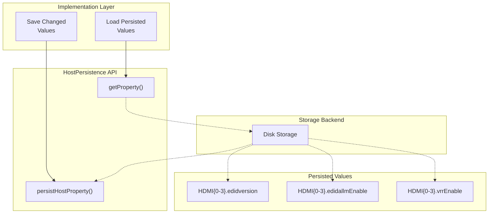
```mermaid
graph TB
    subgraph Impl["Implementation Layer"]
        LOAD["Load Persisted<br/>Values"]
        SAVE["Save Changed<br/>Values"]
    end

    subgraph Persist["HostPersistence API"]
        GET["getProperty()"]
        SET["persistHostProperty()"]
    end

    subgraph Storage["Storage Backend"]
        DISK["Disk Storage"]
    end

    LOAD --> GET
    SAVE --> SET
    
    GET -.-> DISK
    DISK -.-> SET
    
    subgraph Values["Persisted Values"]
        EDID_VER["HDMI{0-3}.edidversion"]
        ALLM["HDMI{0-3}.edidallmEnable"]
        VRR["HDMI{0-3}.vrrEnable"]
    end
    
    DISK -.-> EDID_VER
    DISK -.-> ALLM
    DISK -.-> VRR
```

---

## Implementation Architecture Comparison

### RDKV HAL - Procedural Style

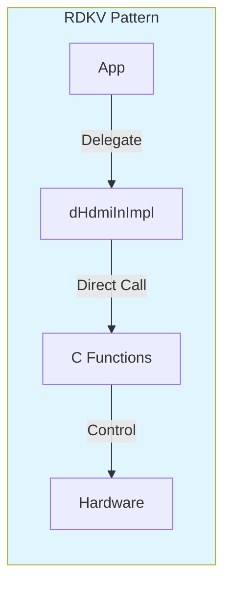
```mermaid
graph LR
    subgraph RDKV["RDKV Pattern"]
        APP1["App"]
        IMPL1["dHdmiInImpl"]
        HAL1["C Functions"]
        HW1["Hardware"]
    end

    APP1 -->|Delegate| IMPL1
    IMPL1 -->|Direct Call| HAL1
    HAL1 -->|Control| HW1
    
    style RDKV fill:#e1f5ff
```

### AIDL HAL - Service-Based Style

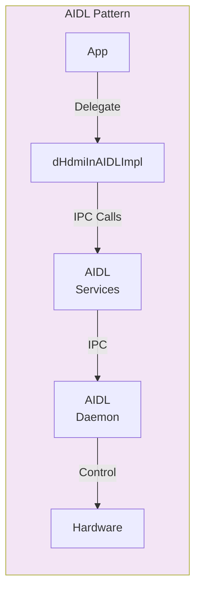
```mermaid
graph LR
    subgraph AIDL["AIDL Pattern"]
        APP2["App"]
        IMPL2["dHdmiInAIDLImpl"]
        SERVICES["AIDL<br/>Services"]
        DAEMON["AIDL<br/>Daemon"]
        HW2["Hardware"]
    end

    APP2 -->|Delegate| IMPL2
    IMPL2 -->|IPC Calls| SERVICES
    SERVICES -->|IPC| DAEMON
    DAEMON -->|Control| HW2
    
    style AIDL fill:#f3e5f5
```

---

## Module Dependencies

### Dependency Graph

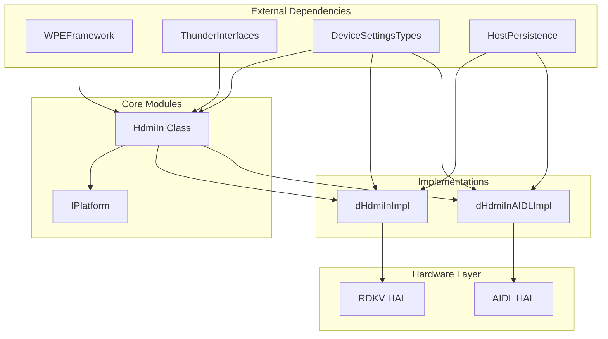
```mermaid
graph TB
    subgraph External["External Dependencies"]
        WPE["WPEFramework"]
        IFACE["ThunderInterfaces"]
        TYPES["DeviceSettingsTypes"]
        PERSIST["HostPersistence"]
    end

    subgraph Core["Core Modules"]
        HDMIIN["HdmiIn Class"]
        IPLATFORM["IPlatform"]
    end

    subgraph Impl["Implementations"]
        RDKV["dHdmiInImpl"]
        AIDL["dHdmiInAIDLImpl"]
    end

    subgraph HAL["Hardware Layer"]
        RDKV_HAL["RDKV HAL"]
        AIDL_HAL["AIDL HAL"]
    end

    WPE --> HDMIIN
    IFACE --> HDMIIN
    TYPES --> HDMIIN
    
    HDMIIN --> IPLATFORM
    HDMIIN --> RDKV
    HDMIIN --> AIDL
    
    TYPES --> RDKV
    TYPES --> AIDL
    
    PERSIST --> RDKV
    PERSIST --> AIDL
    
    RDKV --> RDKV_HAL
    AIDL --> AIDL_HAL
```

---

## Conclusion

The HdmiIn AIDL HAL architecture provides a robust, extensible framework for HDMI Input device management with:

1. **Dual Implementation Support**: Seamlessly switches between RDKV and AIDL backends
2. **Factory Pattern**: Automatic detection with explicit override capability
3. **Clean Abstraction**: IPlatform interface isolates implementations
4. **Backward Compatibility**: Existing code requires no modifications
5. **Event-Driven Design**: Async callback architecture for responsive operation
6. **Persistent State**: Per-port configuration persistence
7. **Comprehensive API**: 21 methods covering all HDMI Input functionality

This architecture ensures smooth migration from legacy RDKV HAL to modern AIDL HAL services while maintaining full backward compatibility and code stability.
