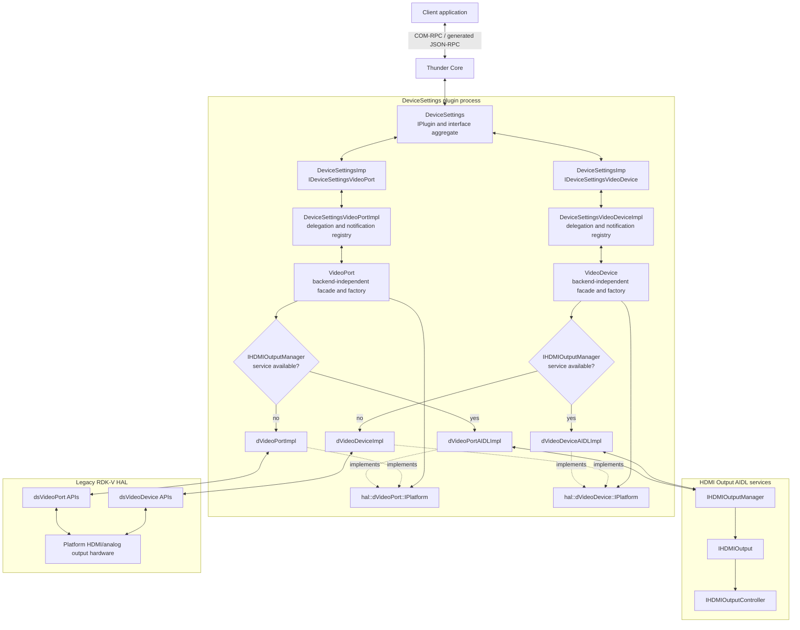
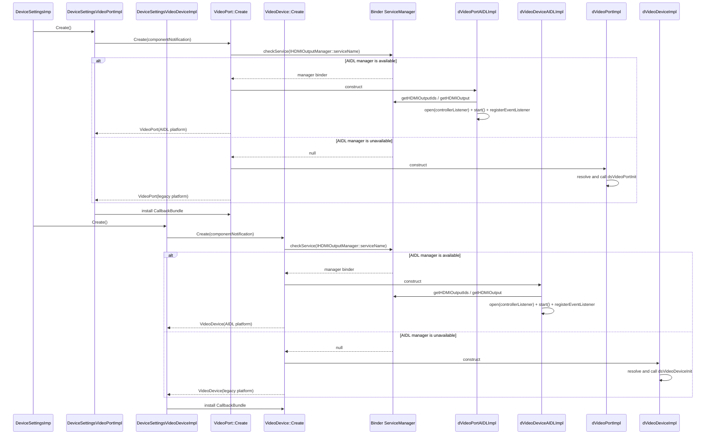
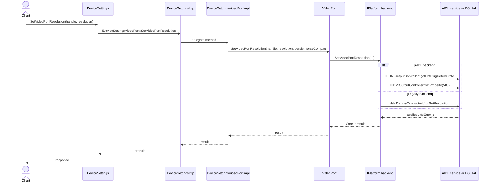
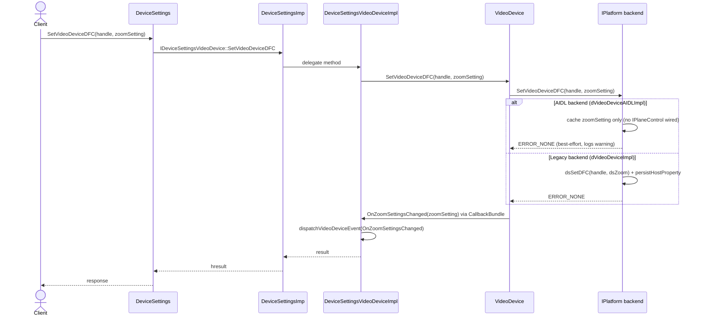
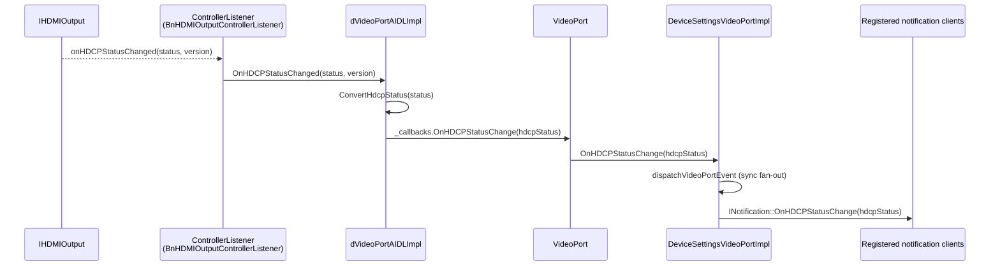
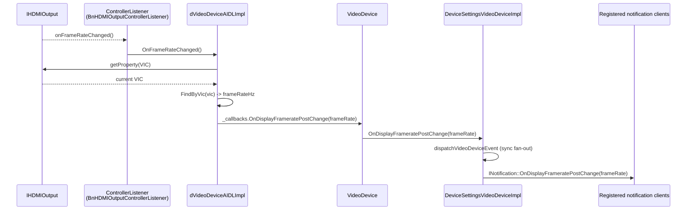

# VideoPort and VideoDevice Architecture

## Purpose

VideoPort and VideoDevice are DeviceSettings components that expose HDMI/analog video output
port control (`Exchange::IDeviceSettingsVideoPort`) and video-device/zoom/HDR control
(`Exchange::IDeviceSettingsVideoDevice`). Like CompositeIn, HDMIIn, and Audio, both are
aggregated by the `DeviceSettings` Thunder plugin rather than deployed as independent plugins.

Each component supports two hardware backends selected independently at runtime:

- **AIDL HAL:** Uses the `com.rdk.hal.hdmioutput` Binder services (`IHDMIOutputManager`,
  `IHDMIOutput`, `IHDMIOutputController`).
- **Legacy DS HAL:** Uses dynamically resolved `dsVideoPort*`/`dsVideoDevice*` APIs from
  `RDK_DSHAL_NAME`.

The backend is selected independently for each component. If `IHDMIOutputManager` is
published, `VideoPort::Create()` constructs `dVideoPortAIDLImpl` and `VideoDevice::Create()`
constructs `dVideoDeviceAIDLImpl`; otherwise they construct the legacy `dVideoPortImpl` /
`dVideoDeviceImpl`. Because most `dsVideoDevice.c` APIs (zoom/DFC, FRF mode, codec info) are
architecturally backed by `IPanelOutput`/`IVideoDecoderManager`/`IPlaneControl` rather than
`IHDMIOutput`, `dVideoDeviceAIDLImpl` only implements the subset of operations that the HDMI
Output AIDL surface can satisfy (HDR mode/capabilities, VIC-encoded frame rate); the rest report
`ERROR_UNAVAILABLE`.

## System Architecture

## Component Responsibilities

| Component | Responsibility |
| --- | --- |
| `DeviceSettings` | Manages Thunder lifecycle, aggregates `IDeviceSettingsVideoPort` and `IDeviceSettingsVideoDevice`, and registers its notification sink for both. |
| `DeviceSettingsImp` | Implements the public Exchange interfaces and delegates VideoPort/VideoDevice operations to the component implementations. |
| `DeviceSettingsVideoPortImpl` | Owns the `VideoPort` facade, manages client notification registrations, and dispatches resolution/HDCP/HDR HAL events (sync and async). |
| `DeviceSettingsVideoDeviceImpl` | Owns the `VideoDevice` facade, manages client notification registrations, and dispatches zoom/frame-rate HAL events. |
| `VideoPort` | Provides a backend-independent API, installs the `CallbackBundle`, and selects the AIDL or legacy backend for HDMI output port control. |
| `VideoDevice` | Provides a backend-independent API, installs the `CallbackBundle`, and selects the AIDL or legacy backend for zoom/HDR/frame-rate control. |
| `hal::dVideoPort::IPlatform` | Defines the common lifecycle, resolution, HDCP, HDR, and color/quantization query-and-control contract. |
| `hal::dVideoDevice::IPlatform` | Defines the common lifecycle, zoom/DFC, HDR-capability, codec-info, and frame-rate contract. |
| `dVideoPortAIDLImpl` | Maps the common VideoPort contract to `IHDMIOutputManager`/`IHDMIOutput`/`IHDMIOutputController` (VIC↔resolution, HDR mode, HDCP status/version). |
| `dVideoDeviceAIDLImpl` | Maps the HDR-capability and VIC-encoded-frame-rate subset of the VideoDevice contract to the same AIDL services; zoom/FRF/codec-info are unsupported (require `IPlaneControl`/`IPanelOutput`/`IVideoDecoderManager`, not wired here). |
| `dVideoPortImpl` | Maps the common VideoPort contract to legacy `dsVideoPort*` functions loaded from the DS HAL library. |
| `dVideoDeviceImpl` | Maps the common VideoDevice contract to legacy `dsVideoDevice*` functions loaded from the DS HAL library. |

## Public Operations (selected)

| Exchange operation | Facade operation | AIDL mapping | Legacy mapping |
| --- | --- | --- | --- |
| Get port handle | `VideoPort::GetVideoPort` | fixed handle for default `IHDMIOutput` | `dsGetVideoPort` |
| Get/Set resolution | `GetVideoPortResolution` / `SetVideoPortResolution` | `IHDMIOutput::getProperty(VIC)` / `IHDMIOutputController::setProperty(VIC)` | `dsGetResolution` / `dsSetResolution` |
| Hotplug/active state | `IsVideoPortDisplayConnected` / `IsVideoPortActive` | `IHDMIOutputController::getHotPlugDetectState` | `dsIsDisplayConnected` |
| HDCP status/version | `GetVideoPortHDCPStatus`, `GetHDCPCurrentProtocolVersionOnVideoPort` | `IHDMIOutputController::getHDCPStatus` / `getHDCPCurrentVersion` | `dsGetHDCPStatus` / `dsGetHDCPCurrentProtocol` |
| HDR mode | `GetVideoEOTF` / `SetForceHDRMode` | `getProperty(HDR_OUTPUT_MODE)` / `setProperty(HDR_OUTPUT_MODE)` | `dsGetVideoEOTF` / `dsSetForceHDRMode` |
| Color-depth capability | `GetColorDepthCapabilities` | `IHDMIOutput::getCapabilities().supportedColorDepths` | `dsColorDepthCapabilities` |
| Get handle | `VideoDevice::GetVideoDeviceHandle` | fixed handle for default `IHDMIOutput` | `dsGetVideoDevice` |
| Zoom/DFC | `SetVideoDeviceDFC` / `GetVideoDeviceDFC` | unsupported (cached only; requires `IPlaneControl`) | `dsSetDFC` / `dsGetDFC` |
| HDR capabilities | `GetHDRCapabilities` | `IHDMIOutput::getCapabilities().supportedHDROutputModes` | `dsGetHDRCapabilities` |
| Display frame rate | `GetCurrentDisplayFrameRate` / `SetDisplayFrameRate` | derived from/applied to `VIC` property | `dsGetCurrentDisplayframerate` / `dsSetDisplayframerate` |

## Event Mapping

| Exchange notification | Facade | AIDL source | Legacy source |
| --- | --- | --- | --- |
| `OnResolutionPreChange` / `OnResolutionPostChange` | VideoPort | `IHDMIOutputControllerListener::onFrameRateChanged` (re-read VIC) | `dsVideoDevice.c` pre/post-change hooks around `dsSetResolution` |
| `OnHDCPStatusChange` | VideoPort | `IHDMIOutputControllerListener::onHDCPStatusChanged` | `dsRegisterHdcpStatusCallback` |
| `OnVideoFormatUpdate` | VideoPort | `dsVideoFormatUpdateRegisterCB` (legacy only; no direct AIDL equivalent) | `dsVideoFormatUpdateRegisterCB` |
| `OnZoomSettingsChanged` | VideoDevice | fired on cached `SetVideoDeviceDFC` call (no HAL-driven event) | manual trigger inside `SetVideoDeviceDFC` |
| `OnDisplayFrameratePreChange` / `OnDisplayFrameratePostChange` | VideoDevice | `IHDMIOutputControllerListener::onFrameRateChanged` / around `SetDisplayFrameRate` | `dsRegisterFrameratePreChangeCB` / `dsRegisterFrameratePostChangeCB` |

## Class Diagram

```mermaid
classDiagram
    class DeviceSettings {
        -IDeviceSettingsVideoPort* _mDeviceSettingsVideoPort
        -IDeviceSettingsVideoDevice* _mDeviceSettingsVideoDevice
        +Initialize(IShell*) string
        +Deinitialize(IShell*) void
    }

    class IDeviceSettingsVideoPort {
        <<Exchange interface>>
        +Register(clientName, notification) hresult
        +Unregister(notification) hresult
        +GetVideoPort(type, index, handle) hresult
        +GetVideoPortResolution(handle, resolution) hresult
        +SetVideoPortResolution(handle, resolution, persist, forceCompatibility) hresult
        +GetVideoPortHDCPStatus(handle, status) hresult
    }

    class IDeviceSettingsVideoDevice {
        <<Exchange interface>>
        +Register(clientName, notification) hresult
        +Unregister(notification) hresult
        +GetVideoDeviceHandle(index, handle) hresult
        +SetVideoDeviceDFC(handle, zoomSetting) hresult
        +GetHDRCapabilities(handle, capabilities) hresult
        +SetDisplayFrameRate(handle, framerate) hresult
    }

    class DeviceSettingsImp {
        -DeviceSettingsVideoPortImpl* _videoPortSettings
        -DeviceSettingsVideoDeviceImpl* _videoDeviceSettings
    }

    class DeviceSettingsVideoPortImpl {
        -VideoPort _videoPort
        -notificationList _VideoPortNotifications
        +Register(clientName, notification) hresult
        +Unregister(notification) hresult
        +dispatchVideoPortEvent()
        +submitVideoPortEvent()
    }

    class DeviceSettingsVideoDeviceImpl {
        -VideoDevice _videoDevice
        -notificationList _VideoDeviceNotifications
        +Register(clientName, notification) hresult
        +Unregister(notification) hresult
        +dispatchVideoDeviceEvent()
    }

    class VideoPort {
        -shared_ptr~IPlatform~ _platform
        -INotification& _parent
        +Create(parent)$ VideoPort
        +Platform_init() void
        +GetVideoPort(type, index, handle) uint32
        +GetVideoPortResolution(handle, resolution) uint32
        +SetVideoPortResolution(handle, resolution, persist, forceCompat) uint32
        +GetVideoPortHDCPStatus(handle, status) uint32
    }

    class VideoDevice {
        -shared_ptr~IPlatform~ _platform
        -INotification& _parent
        +Create(parent)$ VideoDevice
        +Platform_init() void
        +GetVideoDeviceHandle(index, handle) uint32
        +SetVideoDeviceDFC(handle, zoomSetting) uint32
        +GetHDRCapabilities(handle, capabilities) uint32
        +SetDisplayFrameRate(handle, framerate) uint32
    }

    class VideoPortNotification {
        <<VideoPort::INotification>>
        +OnResolutionPreChange(resolution) void
        +OnResolutionPostChange(resolution) void
        +OnHDCPStatusChange(status) void
        +OnVideoFormatUpdate(hdrStandard) void
    }

    class VideoDeviceNotification {
        <<VideoDevice::INotification>>
        +OnZoomSettingsChanged(zoomSetting) void
        +OnDisplayFrameratePreChange(frameRate) void
        +OnDisplayFrameratePostChange(frameRate) void
    }

    class IPlatformVP {
        <<hal::dVideoPort::IPlatform>>
        +InitialiseHAL()* void
        +DeInitialiseHAL()* void
        +setAllCallbacks(bundle)* void
        +GetVideoPort(type, index, handle)* uint32
        +GetVideoPortResolution(handle, resolution)* uint32
        +SetVideoPortResolution(handle, resolution, persist, forceCompat)* uint32
        +GetVideoPortHDCPStatus(handle, status)* uint32
    }

    class IPlatformVD {
        <<hal::dVideoDevice::IPlatform>>
        +InitialiseHAL()* void
        +DeInitialiseHAL()* void
        +setAllCallbacks(bundle)* void
        +GetVideoDeviceHandle(index, handle)* uint32
        +SetVideoDeviceDFC(handle, zoomSetting)* uint32
        +GetHDRCapabilities(handle, capabilities)* uint32
        +SetDisplayFrameRate(handle, framerate)* uint32
    }

    class dVideoPortAIDLImpl {
        -sp~Manager~ _manager
        -sp~Output~ _output
        -sp~Controller~ _controller
        -Output::Id _outputId
        +IsAvailable()$ bool
        -VicToResolution(vic, resolution)$ bool
        -ResolutionNameToVic(name, vic)$ bool
    }

    class dVideoDeviceAIDLImpl {
        -sp~Manager~ _manager
        -sp~Output~ _output
        -sp~Controller~ _controller
        -VideoDeviceZoom _cachedZoom
        -bool _forceDisableHDR
        +IsAvailable()$ bool
    }

    class ControllerListener {
        +onHotPlugDetectStateChanged(state) Status
        +onFrameRateChanged() Status
        +onHDCPStatusChanged(status, version) Status
        +onEDID(edid) Status
    }

    class EventListener {
        +onStateChanged(oldState, newState) Status
    }

    class dVideoPortImpl {
        +getInstance()$ dVideoPortImpl*
        +resolve(library, symbol)$ void*
    }

    class dVideoDeviceImpl {
        +getInstance()$ dVideoDeviceImpl*
        +resolve(library, symbol)$ void*
    }

    DeviceSettings o-- IDeviceSettingsVideoPort : aggregates
    DeviceSettings o-- IDeviceSettingsVideoDevice : aggregates
    DeviceSettingsImp ..|> IDeviceSettingsVideoPort
    DeviceSettingsImp ..|> IDeviceSettingsVideoDevice
    DeviceSettingsImp *-- DeviceSettingsVideoPortImpl
    DeviceSettingsImp *-- DeviceSettingsVideoDeviceImpl
    DeviceSettingsVideoPortImpl *-- VideoPort
    DeviceSettingsVideoDeviceImpl *-- VideoDevice
    DeviceSettingsVideoPortImpl ..|> VideoPortNotification
    DeviceSettingsVideoDeviceImpl ..|> VideoDeviceNotification
    VideoPort --> VideoPortNotification : callbacks
    VideoDevice --> VideoDeviceNotification : callbacks
    VideoPort o-- IPlatformVP
    VideoDevice o-- IPlatformVD
    dVideoPortAIDLImpl ..|> IPlatformVP
    dVideoPortImpl ..|> IPlatformVP
    dVideoDeviceAIDLImpl ..|> IPlatformVD
    dVideoDeviceImpl ..|> IPlatformVD
    dVideoPortAIDLImpl *-- ControllerListener
    dVideoPortAIDLImpl *-- EventListener
    dVideoDeviceAIDLImpl *-- ControllerListener
    dVideoDeviceAIDLImpl *-- EventListener
```

## Initialization And Backend Selection

Both facades run this same selection logic independently; each maintains its own
`IHDMIOutputController` session against the shared default `IHDMIOutput`.

## Resolution Query/Set Call Flow (VideoPort)

## Zoom/DFC Call Flow (VideoDevice)

Illustrates the divergence between backends: the legacy HAL applies zoom to hardware via
`dsSetDFC`, while the AIDL backend only caches the value because zoom (`ASPECT_RATIO`) is a
`IPlaneControl` property that is out of scope for the HDMI Output AIDL package used here.

## HDCP Status Event Flow (VideoPort, AIDL backend)

## Frame Rate Change Event Flow (VideoDevice, AIDL backend)

## Backend Capability Notes

| Area | AIDL backend (`dVideoPortAIDLImpl` / `dVideoDeviceAIDLImpl`) | Legacy backend (`dVideoPortImpl` / `dVideoDeviceImpl`) |
| --- | --- | --- |
| Resolution set/get | Supported via `Property::VIC` on a fixed subset of common resolutions (480p, 576p50, 720p, 1080i/p variants, 2160p variants). | Supported for the full platform-configured resolution list. |
| Quantization range, color space, matrix coefficients, surround mode, background color, HDMI preference, force-disable-4K | Not exposed by `com.rdk.hal.hdmioutput`; getters return `ERROR_UNAVAILABLE`, setters are logged no-ops. | Supported when the corresponding optional `dsVideoPort*` symbol is present in the platform DS HAL library. |
| HDCP enable/disable | Not exposed by `IHDMIOutputController`; returns `ERROR_UNAVAILABLE`. | Supported via `dsEnableHDCP`. |
| Zoom/DFC (VideoDevice) | Cached only; requires `IPlaneControl` (out of scope for this integration). | Fully supported via `dsSetDFC`/`dsGetDFC` with persistence. |
| FRF mode, codec info, supported coding formats (VideoDevice) | Not exposed by `IHDMIOutput`; requires `IPanelOutput`/`IVideoDecoderManager`. | Supported via optional `dsSetFRFMode`/`dsGetVideoCodecInfo`/`dsGetSupportedVideoCodingFormats` symbols. |

## Build-Time Backend Enablement

`plugin/CMakeLists.txt` probes for the `com.rdk.hal.hdmioutput` AIDL headers/library
(`IHDMIOutputManager.h`, `hdmioutput-v0.1.0.0-cpp`) alongside the shared `common` AIDL types and
Binder libraries. When found, `hal/dVideoPortAIDLImpl.cpp` and `hal/dVideoDeviceAIDLImpl.cpp`
are compiled in under the `ENABLE_HDMIOUTPUT_AIDL` macro; `VideoPort::Create()` and
`VideoDevice::Create()` then probe `IsAvailable()` at runtime (service actually published, not
just linked) before choosing the AIDL implementation. When the AIDL artifacts are not found at
configure time, the plugin builds DS HAL-only, matching the pre-existing behavior.
